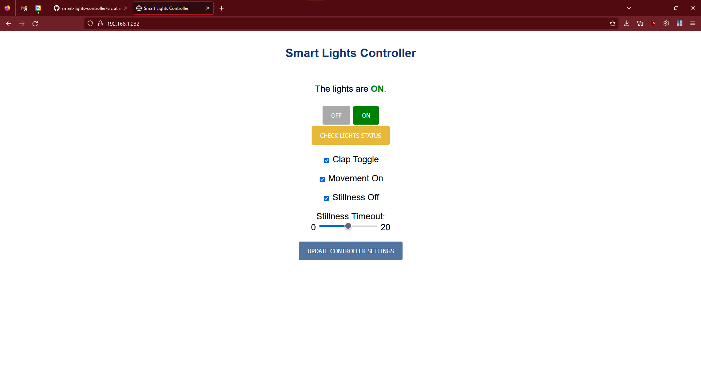

# Smart Lights Controller

ESP32-based IoT controller to turn TP-Link Kasa HS100 smartplug off and on based on motion and sound.

I made a video about the device, availabe here:

## Software

All the files in the `src` directory were uploaded to the root directory of an ESP32 flashed with micropython firmware.

Below is a screenshot of the user interface, available on the device's local wifi network.

`ssd1306.py` and an original version of `wifi.py` were provided as part of course material for ENME441: Mechatronics and the Internet of Things at the University of Maryland, by Dr. Don DeVoe. `wifi.py` has been altered significantly.

`uQR.py` was taken, in accordance to the license, from the [uQR GitHub repository](https://github.com/JASchilz/uQR), Copyright (c) 2018, Joseph Schilz.

`tp_link.py` is adapted, in accordance to the license, from files in the [softScheck tplink-smartplug GitHub repository](https://github.com/softScheck/tplink-smartplug) by Lubomir Stroetmann, Copyright 2016 softScheck GmbH.

## Hardware

The housing for the device was 3d printed from the files in the `CAD` directory at the University of Maryland's [Sandbox](https://sandbox.iribe.umd.edu/) maker space.

The following components were used:

- ESP32: [HiLetgo ESP32 OLED WiFi Kit](https://www.amazon.com/gp/product/B07DKD79Y9) (with the original display removed)
- Microphone: [DEVMO Microphone Sensor](https://www.amazon.com/dp/B07S4DTKYH)
- Motion detector: [HiLetgo HC-SR501 PIR Infrared Sensor](https://www.amazon.com/dp/B07KZW86YR)
- Display: [UCTRONICS 0.96 Inch OLED Module 12864](https://www.amazon.com/dp/B072Q2X2LL)
